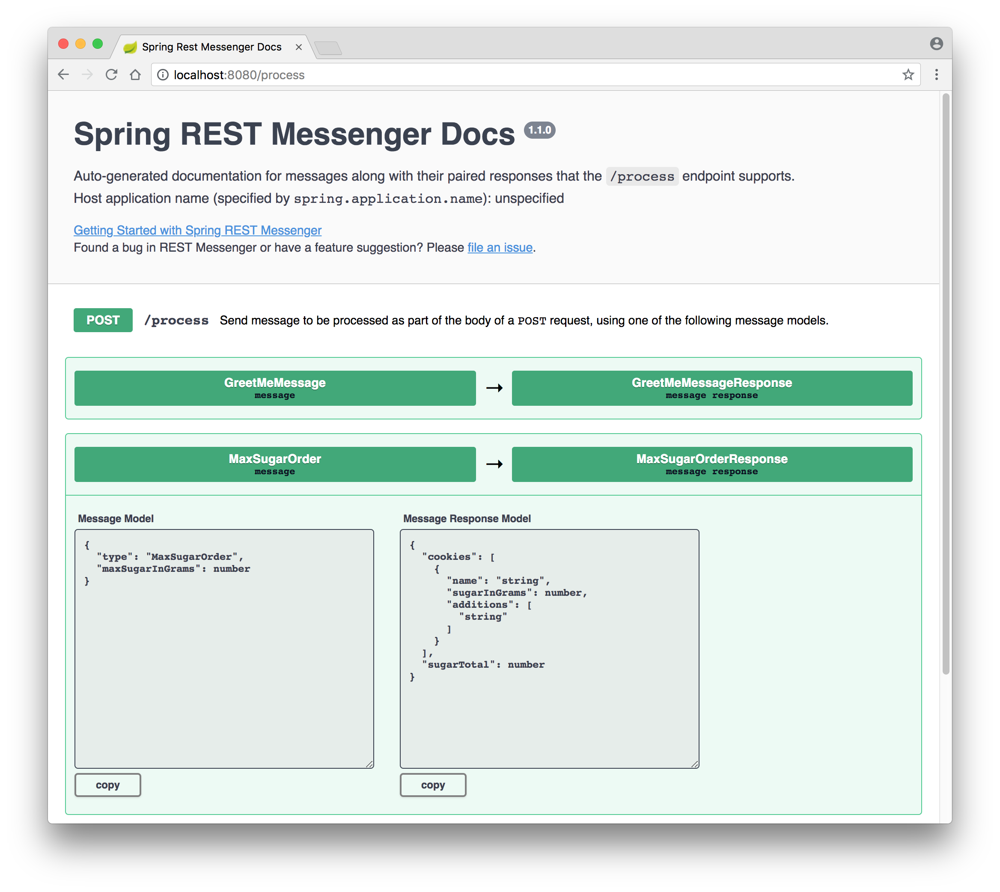

# REST Messenger
Easily create and expose a Spring REST-based API implementation, without losing strong Java message typing, improving simplicity and robustness of your implementations.

It's so easy to use, you can start implementing your APIs in under 5 minutes. 

Yes, really. Just see the [How](#how) section.

## Releases
See [releases](https://github.com/clearlydecoded/rest-messenger/releases) section for a list of features by release.

## Why?

**If you don't care about philosophical blah blah, just skip this section. You've been warned. :-)**

It is very often the case that the standard REST conventions of providing separate endpoints for CRUD (**C**reate with `POST`, **R**ead with `GET`, etc.) don't fit some use cases. This is especially true when the API you are trying to create is for a microservice.

In many such cases (or even if you feel like it's appropriate to break the REST convention), you'd need to implement the API in a way that is simple to define, simple to maintain, and simple to add new API functionality to.

Going to full blown Enterprise Integration frameworks like Spring Integration or Apache Camel is overkill in a *lot* of scenarios. In the opinions of people a lot smarter than I, you should always strive for simple solutions to complex problems, not complicated solutions to simple problems. Use those frameworks when they make super complex things simpler, not straightforward use cases complicated.

In most cases, projects are looking for a very simple and straightforward way to expose their API to outside clients, be they truly external or simply a microservice which is part of an enterprise integration effort.

One of the fairly standard integration design patterns (i.e, approaches) for creating an API is some variation of the Request-Response Pattern. This framework adapts a Command Pattern-like approach to implementing the Request-Response Pattern. 

It has many advantages (and a minor disadvantage), but the main benefit (in my experience) is that the pattern, by *its nature of focus and simplicity*, pushes you to produce very clean and easy to use APIs. It forces you to focus on a single request/message (just an POJO) with specific properties that are needed to accomplish some outcome, represented by a response (another POJO).

However, when it comes to implementing this pattern in Java, especially when receiving these requests over HTTP as JSON, there are some challenges:
* We want Java's strong *compile-time* type verification benefits but a serialized generic message coming in as JSON doesn't contain any Java typing information. It's just a string. Creating a separate endpoint for each type of message creates more boilerplate code, increasing complexity and uncertainty of which endpoint to use when and how to use it, especially as the API grows in size.
* We'd like to have a single endpoint that accepts all kinds of messages (with a `type` property), but we don't want to have to update some giant `switch` statement every time we add a new message to our API. This is tedious and error-prone.
* We need a simple and reliable mechanism to route these messages to the places in our system that process them. Ideally, we want the Java *compile-time* type verification involved so there would be no room for runtime errors.
* We need a *compile-time* mechanism to ensure that our message, message response, and message processor are compatible and that there is no way to make a mistake about which message goes with which response and is then processed by which processor.

The REST-MESSENGER framework takes care of all of these challenges in a lightweight manner with *zero* effort on your part.

Blah blah blah... Just tell me how to use it already!

Ok, ok. If you are that impatient, just jump to the [How](#how) section.

## Features
See [releases](https://github.com/clearlydecoded/rest-messenger/releases) section for a list of features by release.

### v1.0.0
* Single (and simple!) line of code to configure
* (*at startup*) Automatic discovery of message processors in your system 
* (*at startup*) Automatic validation that message processors are properly wired to support correct message routing to their strongly typed message processors 
* Automatic conversion of JSON-based messages to a concrete message class defined in your system
* Automatic routing of messages to their specific, strongly typed message processors
* (*at startup*) Automatic validation of message and response POJOs' ability to correctly deserialize into JSON, letting you find out right away that something is wrong instead of much later into the application use when that particular message is received
### v1.1.0
* Easy to use *automatically* generated docs for your application messages & message responses
  * Simply point your browser to the endpoint URI (by default `/process` or configured by you with `com.clearlydecoded.messenger.endpoint.uri` property) and an automatically generated docs page will display
  * For example, something like this:
  
### v2.0.0 - breaking changes (very minor)
* Users can now simply extend the `AbstractMessageProcessor` class and not have to implement *any* of the boilerplate code.
  * No more need to implement `MessageProcessor` unless you need more control over how things are wired (in most cases, you won't care)
  * String type identifier will automatically pick up the message type string identifier.
* Methods in the interface for getting class names have been made consistent. (**breaking change**)
  * Minor because the name of one of the boilerplate methods changed slightly.
* Stricter processor registration validation.
  * Checks when registering processors that no other processors in the system are already registered with the same string-based type ID.
  * If it finds another one already registered, throws `IllegalStateException`, thus preventing quiet overriding of existing processor.

## Dependecies
* Java 8 and above
* Spring Boot 1.x and above

## How
Set your stopwatch. This will take 5 minutes.

2 simple steps to configure the framework.

**Step 1**: Start with a simple Spring Boot configured `pom.xml` and add `rest-messenger` dependency to it.

Add the following dependency to your maven `pom.xml` file:
```xml
<dependency>
  <groupId>com.clearlydecoded</groupId>
  <artifactId>rest-messenger</artifactId>
  <version>1.1.0</version>
</dependency>
```

For example:
```xml
<?xml version="1.0" encoding="UTF-8"?>
<project xmlns="http://maven.apache.org/POM/4.0.0"
  xmlns:xsi="http://www.w3.org/2001/XMLSchema-instance"
  xsi:schemaLocation="http://maven.apache.org/POM/4.0.0 http://maven.apache.org/xsd/maven-4.0.0.xsd">
  <modelVersion>4.0.0</modelVersion>

  <parent>
    <groupId>org.springframework.boot</groupId>
    <artifactId>spring-boot-starter-parent</artifactId>
    <version>2.0.3.RELEASE</version>
    <relativePath/>
  </parent>

  <groupId>com.clearlydecoded</groupId>
  <artifactId>rest-messenger-demo</artifactId>
  <packaging>war</packaging>
  <version>1.1.0</version>

  <properties>
    <java.version>1.8</java.version>
  </properties>

  <dependencies>
    <dependency>
      <groupId>org.springframework.boot</groupId>
      <artifactId>spring-boot-starter-web</artifactId>
    </dependency>

    <!-- ADD THIS DEPENDENCY -->
    <dependency>
      <groupId>com.clearlydecoded</groupId>
      <artifactId>rest-messenger</artifactId>
      <version>1.1.0</version>
    </dependency>

  <build>
    <plugins>
      <plugin>
        <groupId>org.springframework.boot</groupId>
        <artifactId>spring-boot-maven-plugin</artifactId>
      </plugin>
    </plugins>
  </build>

</project>
```

**Step 2**: Create `SpringRestMessenger` as a bean in a `@Configuration` class. (You can do this directly in the class annotated with `@SpringBootApplication` instead if you choose.)

For example:
```java
package com.clearlydecoded.messenger.demo;

import com.clearlydecoded.messenger.rest.SpringRestMessenger;
import org.springframework.context.ApplicationContext;
import org.springframework.context.annotation.Bean;
import org.springframework.context.annotation.Configuration;

@Configuration
public class AppConfig {

  @Bean
  protected SpringRestMessenger createSpringRestMessenger(ApplicationContext springContext) {
    return new SpringRestMessenger(springContext);
  }
}
```

✅ That's it! Configuration is done!

Now, we can start creating the message, message response, and message processor classes.

**Step 1**: Define a POJO you expect as a message response (you'll see why response is first in a second).

It must implement the `com.clearlydecoded.messenger.MessageResponse` interface.

For example:
```java
package com.clearlydecoded.messenger.demo.message;

import com.clearlydecoded.messenger.MessageResponse;
import java.util.Objects;

public class GreetMeMessageResponse implements MessageResponse {

  /**
   * The actual data we want as the response.
   */
  private String greeting;

  /**
   * MUST at least have a no-arg constructor.
   **/
  public GreetMeMessageResponse() { }

  public GreetMeMessageResponse(String greeting) { this.greeting = greeting; }

  public String getGreeting() { return greeting; }

  public void setGreeting(String greeting) { this.greeting = greeting; }

  @Override
  public boolean equals(Object o) { // cut out for brevity }

  @Override
  public int hashCode() { // cut out for brevity }

  @Override
  public String toString() { // cut out for brevity }
}
```

**Step 2**: Define a POJO you expect to receive as a message request.

It must implement the `com.clearlydecoded.messenger.Message` interface that be generically typed with the
previously defined message response POJO class. In this case, `GreetMeMessageResponse`.

For example:
```java
package com.clearlydecoded.messenger.demo.message;

import com.clearlydecoded.messenger.Message;
import java.util.Objects;

public class GreetMeMessage implements Message<GreetMeMessageResponse> {

  /**
   * Set up the required message type identifier like so.
   * There are other ways to define it, but this approach is nice.
   */
  public static final String TYPE = "GreetMe";
  private final String type = TYPE;

  /**
   * The actual data we want to pass to the processor.
   */
  private String myName;

  /**
   * MUST at least have a no-arg constructor.
   */
  public GreetMeMessage() { }

  public GreetMeMessage(String myName) { this.myName = myName; }

  public String getMyName() { return myName; }

  public void setMyName(String myName) { this.myName = myName; }

  @Override // This is a required interface method
  public String getType() { return type; }

  @Override
  public boolean equals(Object o) { // cut out for brevity }

  @Override
  public int hashCode() { // cut out for brevity }

  @Override
  public String toString() { // cut out for brevity }
}
```

**Step 3**: Define message processor class.

The processor class must extend the `com.clearlydecoded.messenger.AbstractMessageProcessor` abstract class, be annotated with either `@Service`, `@Component`, etc. for Spring to discover it, and be generically typed with the previously defined message and message response POJO classes. In this case, `GreetMeMessage` and `GreetMeMessageResponse`.

For example:
```java
package com.clearlydecoded.messenger.demo.processor;

import com.clearlydecoded.messenger.AbstractMessageProcessor;
import com.clearlydecoded.messenger.demo.message.GreetMeMessage;
import com.clearlydecoded.messenger.demo.message.GreetMeMessageResponse;
import org.springframework.stereotype.Service;

@Service // Must have this annotation for Spring to discover the class
public class GreetMeMessageProcessor extends
    AbstractMessageProcessor<GreetMeMessage, GreetMeMessageResponse> {

  @Override
  public GreetMeMessageResponse process(GreetMeMessage message) {

    // This is where you write the actual business logic
    return new GreetMeMessageResponse("Hello " + message.getMyName());
  }
}
```

👉 TIP! Once you type in `extends AbstractMessageProcessor<GreetMeMessage, GreetMeMessageResponse>`, have your IDE generate the unimplemented method for you automatically.

Now, *"rinse and repeat"* as you expand your API.

✅ That's it! 3 simple classes for a very clearly defined endpoint API.

Now, start up the application with a simple maven command:
```bash
mvn spring-boot:run
```
Look closely at the logs. Depending on the configured logging level, at the very least, you should see something like this:

```bash
...DefaultMessageProcessorRegistry: Registered [GreetMeMessageProcessor] to process
 messages of type [GreetMeMessage] identified by [GreetMe]
...
...SpringRestMessenger: REST-MESSENGER endpoint configured for URI: /process. To 
configure custom URI, supply 'com.clearlydecoded.messenger.endpoint.uri' property.
```

To test this message/response with a browser, download a REST client plugin (e.g., [Restlet Client for Chrome](https://chrome.google.com/webstore/detail/restlet-client-rest-api-t/aejoelaoggembcahagimdiliamlcdmfm)) and send the following in the body of the `POST` request to the `/process` URI:

```json
{
  "type": "GreetMe", 
  "myName": "Yaakov"
}
```

The server will respond with:
```json
{"greeting":"Hello Yaakov"}
```

## Fully Functional Demo Application
To see full source code of an application using rest-messenger for demo purposes, see the [rest-messenger-demo](https://github.com/clearlydecoded/rest-messenger-demo) repository.

## FAQ

* **Q**: Can the default `/process` URI be configured to a custom URI value? <br>
  **A**: YES! Simply provide your own value for the `com.clearlydecoded.messenger.endpoint.uri` property to override the default.
  
* **Q**: How can I ask a question about any of this or contribute to the framework? <br>
  **A**: File a new issue or comment on an existing one.
  
* **Q**: Can the POJO code be even cleaner? <br>
  **A**: YES! check out [Project Lombok](https://projectlombok.org/). You'll never write another getter/setter by hand again. The code is SO much cleaner looking. For an example, take a look at [`MaxSugarOrder.java`](https://github.com/clearlydecoded/rest-messenger-demo/blob/master/src/main/java/com/clearlydecoded/messenger/demo/message/MaxSugarOrder.java) and [`MaxSugerOrderResponse.java`](https://github.com/clearlydecoded/rest-messenger-demo/blob/master/src/main/java/com/clearlydecoded/messenger/demo/message/MaxSugarOrderResponse.java) in the [rest-messenger-demo](https://github.com/clearlydecoded/rest-messenger-demo) repository.
  
* **Q**: How do I version my API? <br>
  **A**: At the moment, the only way to version the API is to provide a different string-based type identifier in your message POJO. For example, if you had `GreetMeMessage` as the string-based type identifier and your POJO needs to change to a different version of the message, create another message class and identify it with `GreetMeMessagev2`.

* **Q**: So, what's the disadvange of using this pattern and framework? <br>
  **A**: 3 classes are required to accomplish *each* request-process-response. Luckily, these are simple classes and a significantly larger number of Java files in your project isn't a problem, especially if you neatly organize them into some `mesage`, `response`, and `processor` packages. You can always organize those even further, of course. You should also be able to easily tell what the message is going to accomplish by simply looking at the Java file name. In other words, `message/UpdateIndex.java` should give you a strong hint as to what it does.
  

